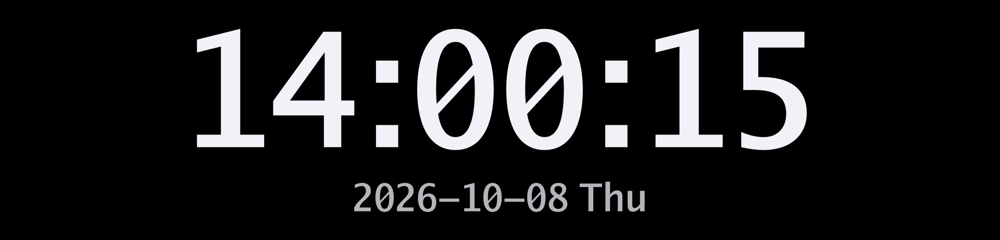
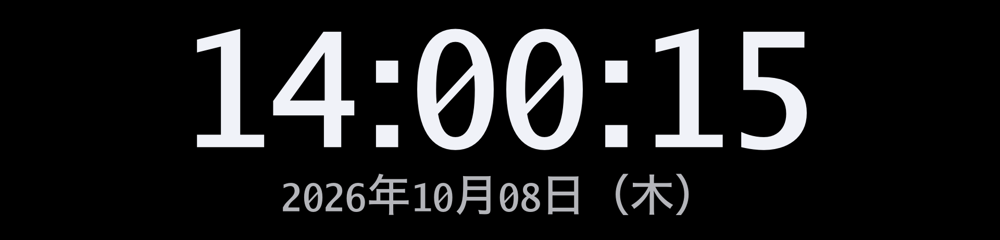
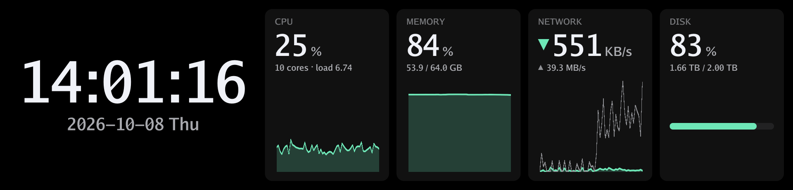
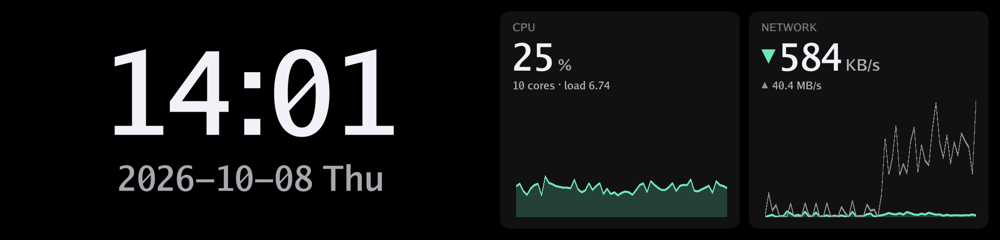
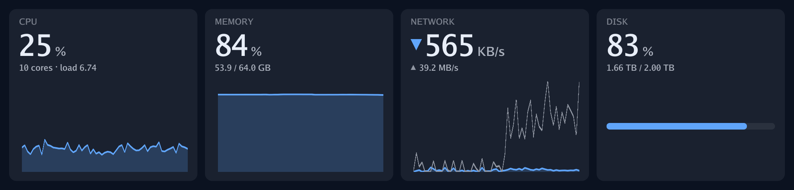
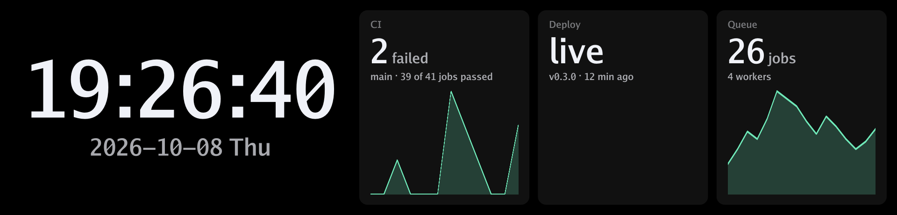

# sub-screen-player

[](https://github.com/nomunomu0504/sub-screen-player/actions/workflows/ci.yml)
[](https://github.com/nomunomu0504/sub-screen-player/releases/latest)
[](#ライセンス)

[English](README.md) · **Web サイト: [subscreen.dev](https://subscreen.dev/ja/)**（ダウンロード、1行インストール、ドキュメント）

USB 接続の小型サブディスプレイ（モニター下や PC ケース内に置く横長のバー型ディスプレイ）を、
macOS・Linux・Windows から操作するためのツールです。単一バイナリの `ssp` が常駐デーモンとして
ディスプレイとの接続を保ち、時計・画像・最大 60fps のライブ映像を表示します。HTTP / WebSocket
API を通して、他のプログラムからも自由に描画できます。

> **ステータス: 初期段階 (v0.1)**。D92 は macOS（Apple Silicon）と、ARM64 版の Linux（Ubuntu 24.04）・
> Windows 11 で、`ssp selftest` による動作確認が取れています。x86_64 版の Linux と Windows は CI でビルドを
> 確認していますが、実機ではまだ試していません。報告を歓迎します。

## 対応ディスプレイ

| ディスプレイ | パネル | USB ID | 状況 |
|---|---|---|---|
| upHere D92 / MiraBox D92 (9.2 インチ) | 1920x462 | `2100:0006` (HID) | macOS・Linux・Windows（ARM64）で確認済み: 最大 60fps のライブ表示、保存画像、明るさ、電源（[詳細](docs/devices/d92.ja.md#確認済みの環境)） |

ほかの機種を使いたい場合は [機種の追加方法](docs/adding-a-device.ja.md) を参照してください。
書く必要があるのは機種固有のプロトコル部分だけで、それ以外は共通です。

## 主な機能

- **最大 60fps のライブ表示**: エンコードと送信を別スレッドで並行して行います。デバイスが受け取れる
  速さを超えてフレームが届いた場合は、最新のものだけを送ります。
- **時計を内蔵**: 表示形式と色を設定できます。日本語の日付も表示できます。
- **システムダッシュボード**: 時刻と、CPU・メモリ・ネットワーク・ディスクの使用状況を、直近1分のグラフ付きで
  並べて表示します。
- **自分の数値もダッシュボードに**: CI の状態、キューの長さ、天気など、どんなスクリプトからでも `ssp metric set` や
  API で値を送れば、グラフ付きのパネルとして表示されます。
- **画像・アニメーションの表示**: PNG・JPEG・GIF・WebP に対応し、`contain` / `cover` / `stretch` でパネルに合わせます。
  アニメーション GIF・APNG・WebP は繰り返し再生します。
  電源を切っても残るようにデバイスへ保存することもできます。
- **HTTP + WebSocket API**: どの言語のスクリプトやアプリからでも描画できます。
- **抜き差しに追従**: 挿し直すと、それまでの表示内容を再開します。
- **ログイン時の自動起動**: launchd / systemd ユーザーユニット / Windows の `Run` キー
- **安全な初期設定**: API は既定で localhost のみ待ち受け、Web ページからのリクエストは拒否します。
  ネットワークに公開する場合はトークンが必須です。

## 表示のパターン

組み込みの画面の例です。TOML で書いた設定は設定ファイルに書きます（`ssp config init` で作成できます。編集したらデーモンを
再起動してください）。

**時計**（`ssp clock`）。起動時の既定の表示です。



**日本語の日付**。OS に入っているフォントで描きます。



```toml
[clock]
date_format = "%Y年%m月%d日（%a）"
weekdays = ["日", "月", "火", "水", "木", "金", "土"]
```

**時刻だけを大きく、好きな色で。**


```toml
[clock]
seconds = false
date_format = ""
color = "#FFD080"
```

**ダッシュボード**（`ssp dashboard`）。時刻と、CPU・メモリ・ネットワーク・ディスクの使用状況を、直近1分のグラフ付きで
並べます。



**パネルを絞る**。例: `ssp dashboard --widgets clock,cpu,network`（`[clock]` で `seconds = false`）



**色を変える**（時計なし）。



```toml
[dashboard]
widgets = ["cpu", "memory", "network", "disk"]
color = "#E8EEF8"
accent = "#60A5FA"
background = "#0B1220"
```

**自分の数値を並べる**。どんなスクリプトからでも `ssp metric set` で値を送り、`metric:<id>` のパネルを並べます
（[使い方](docs/cli.ja.md#自分の数値を表示するci-の状態キュー天気など)）。



```sh
ssp metric set ci --value 2 --label CI --unit failed --detail "main · 39 of 41 jobs passed"
ssp dashboard --widgets clock,metric:ci,metric:deploy,metric:queue
```

ほかにも、`ssp show` で画像を表示したり、自作のプログラムからフレームを送ったり（[後述](#自作プログラムから描画する)）
できます。

## インストール

### 1行インストール

```sh
curl -fsSL https://subscreen.dev/install.sh | sh              # macOS・Linux
powershell -c "irm https://subscreen.dev/install.ps1 | iex"   # Windows
```

お使いの環境向けの最新リリースをダウンロードし、SHA-256 チェックサムを確認してから `ssp` を `PATH` の通った場所に置きます。

### ビルド済みバイナリ

[最新のリリース](https://github.com/nomunomu0504/sub-screen-player/releases/latest)から使っている環境のアーカイブを
ダウンロードして展開し、`ssp`（Windows では `ssp.exe`）を `PATH` の通った場所に置いてください。

| 環境 | アーカイブ |
|---|---|
| macOS（Apple Silicon・Intel 共通） | `ssp-<version>-universal-apple-darwin.tar.gz` |
| Linux x86_64 / arm64（静的リンク。ディストリビューションを問いません） | `ssp-<version>-x86_64-unknown-linux-musl.tar.gz` / `...-aarch64-unknown-linux-musl.tar.gz` |
| Windows x64 / ARM64 | `ssp-<version>-x86_64-pc-windows-msvc.zip` / `...-aarch64-pc-windows-msvc.zip` |

チェックサムは `SHA256SUMS.txt` にあります。バイナリはまだコード署名をしていないため、次の対応が必要な場合があります。

- **macOS**: ダウンロードした `ssp` の実行が拒否されることがあります。一度だけ隔離属性を外してください:
  `xattr -d com.apple.quarantine ssp`
- **Windows**: 初回起動時に SmartScreen の警告が出ることがあります。「詳細情報」→「実行」を選んでください。

### ソースからビルドする

ソースからビルドします。Rust のバージョンは [mise](https://mise.jdx.dev) で固定しています。macOS では
Xcode Command Line Tools（`xcode-select --install`）、Windows では Rust がもともと使う Visual Studio の C++ ビルドツールも
必要です（同梱の hidapi ライブラリのコンパイルに使います）。

```sh
git clone https://github.com/nomunomu0504/sub-screen-player.git
cd sub-screen-player
mise install            # mise.toml に書かれた Rust を導入
mise run build          # target/release/ssp ができます
```

Rust がすでに入っている場合は `cargo install --path crates/cli --locked` でも構いません。

### Linux のアクセス権

一般ユーザーがディスプレイにアクセスできるよう udev ルールを入れてから、ディスプレイを挿し直してください。ルールファイルは
Linux 向けアーカイブと、ソースの `contrib/linux/` に入っています。

```sh
sudo cp contrib/linux/70-sub-screen-player.rules /etc/udev/rules.d/
sudo udevadm control --reload-rules
```

## 使い方

```sh
ssp serve                      # デーモンを起動（Ctrl-C で終了）。時計が表示されます
```

別のターミナルで:

```sh
ssp devices                    # ディスプレイ一覧
ssp show photo.jpg --fit cover # 画像を表示
ssp clock --no-seconds         # 秒なしの時計に戻す
ssp dashboard                  # 時刻と CPU・メモリ・ネットワーク・ディスクを並べて表示
ssp brightness 60              # 明るさ（%）
ssp off                        # 画面を消す（`ssp on` で点灯）
ssp status                     # フレーム数や処理時間
ssp selftest                   # ディスプレイを検査（デーモンを止めて実行）
ssp service install            # ログイン時にデーモンを自動起動
```

ディスプレイが複数ある場合は `--display <id>` で選びます（ID は `ssp devices` で確認できます）。
すべてのオプションや、夜間に暗くする・別の PC から操作するといった使い方は [コマンドラインガイド](docs/cli.ja.md) にまとめています。

## 設定

`ssp config init` でコメント付きの設定ファイルを作成できます。場所は `ssp config path` で確認できます。
どの項目も省略可能です。

```toml
listen = "127.0.0.1:7920"

[display]
brightness = 80          # 接続時に設定する明るさ
on_exit = "leave"        # 終了時: "leave" / "save-last" / "clear" / "sleep"

[startup]
show = "clock"           # 接続時の表示: "clock" / "dashboard" / "image" / "nothing"

[clock]
seconds = true
date_format = "%Y-%m-%d %a"
```

## 自作プログラムから描画する

WebSocket でフレームを送ります。バイナリメッセージ1つが1フレーム（PNG や JPEG などの画像、または生ピクセル）です。

```python
import asyncio, io, websockets
from PIL import Image, ImageDraw

async def main():
    url = "ws://127.0.0.1:7920/api/v1/displays/default/stream"
    async with websockets.connect(url) as ws:
        for n in range(600):
            img = Image.new("RGB", (1920, 462))
            ImageDraw.Draw(img).text((40, 200), f"frame {n}", fill="white")
            buf = io.BytesIO()
            img.save(buf, "JPEG")
            await ws.send(buf.getvalue())
            await asyncio.sleep(1 / 30)

asyncio.run(main())
```

画像を1枚送るだけなら HTTP でも送れます。

```sh
curl --data-binary @photo.png "http://127.0.0.1:7920/api/v1/displays/default/image?fit=cover"
```

すべてのエンドポイントは [docs/api.ja.md](docs/api.ja.md) にまとめています。

## 注意点

- `ssp show --persist` と `on_exit = "save-last"` は、画像をデバイスのフラッシュメモリに書き込みます。
  たまに使う分には問題ありませんが、毎フレーム使うのは避けてください。
- D92 は、デーモンからのキープアライブが止まると約 8 秒後に自動で再起動し、最後に保存された画像を表示します。
- D92 の公式アプリにある「拡張スクリーン」モード（`SCREEN` コマンド）を送ると、抜き差しするまで操作を
  受け付けなくなります。このプロジェクトでは送信しません。

## ドキュメント

どのドキュメントも日本語版と英語版があります（各ページ冒頭のリンクで切り替えられます）。

- [コマンドラインガイド](docs/cli.ja.md): ユースケースと全コマンドの説明
- [アーキテクチャ](docs/architecture.ja.md): 全体の構成と、どこに何を書くか
- [機種の追加方法](docs/adding-a-device.ja.md)
- [HTTP / WebSocket API](docs/api.ja.md)
- [D92 プロトコルメモ](docs/devices/d92.ja.md)
- [コントリビュートの手引き](CONTRIBUTING.ja.md)

## ライセンス

[Apache License 2.0](LICENSE-APACHE) と [MIT License](LICENSE-MIT) のデュアルライセンスで、
どちらかを選んで利用できます。同梱の Go フォントは独自の BSD 系ライセンスです
（[crates/server/assets/fonts/LICENSE-Go-fonts.txt](crates/server/assets/fonts/LICENSE-Go-fonts.txt)）。

本プロジェクトは upHere・MiraBox などのディスプレイメーカーとは関係がなく、承認も受けていません。
各機種のプロトコルは相互運用のために調べたものです。
