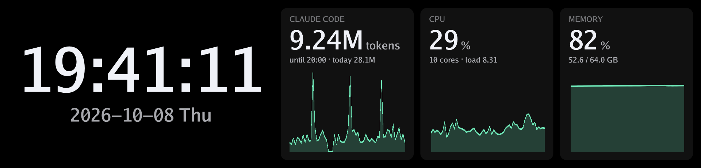
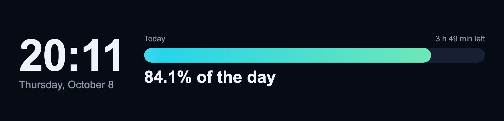

# コマンドラインガイド

[English](cli.md)

操作はすべて `ssp` という1つのコマンドで行います。`ssp serve` がディスプレイを管理するデーモンを動かし、
それ以外のコマンドはすべて、そのデーモンに [HTTP API](api.ja.md) で処理を依頼します。

- [ユースケース](#ユースケース): よくある使い方のレシピ
- [コマンドリファレンス](#コマンドリファレンス): すべてのコマンドとオプション
- [トラブルシューティング](#トラブルシューティング)

## ユースケース

### ログインしている間ずっと時計を表示する

```sh
ssp service install
```

これでログイン時にデーモンが起動し、見つけたすべてのディスプレイに時計を表示します。時計の見た目をずっと変えておきたい
場合は、設定ファイルを作って `[clock]` セクションを編集します。

```sh
ssp config init        # コメント付きの設定ファイルを作成し、そのパスを表示
```

```toml
[clock]
seconds = false
date_format = "%a %-d %b"     # 例: "Wed 7 Oct"。"" にすると日付を表示しません
color = "#FFD080"
```

編集したら、デーモンが設定を読み直すように[再起動](#自動起動)してください。

日付を日本語にする場合は、`weekdays` に日曜日から順に曜日の名前を書くと、`%a`（と `%A`）がその名前になります。
内蔵フォントにない文字（日本語など）は、OS に入っているフォント（macOS はヒラギノ、Windows は游ゴシックやメイリオ、
Linux は Noto Sans CJK など）で描きます。Linux で日本語が表示されない場合は、`fonts-noto-cjk` などを入れてください。

```toml
[clock]
date_format = "%Y年%m月%d日（%a）"     # 例: "2026年10月08日（木）"
weekdays = ["日", "月", "火", "水", "木", "金", "土"]
```

その場だけ変えたい場合は、オプションで指定します。

```sh
ssp clock --no-seconds --date-format ""
```

### 時刻と一緒に CPU・メモリ・ネットワークの使用状況を表示する

```sh
ssp dashboard
```

ダッシュボードには、時刻（書式は `[clock]` に従います）と、CPU・メモリ・ネットワーク・ディスクのパネルが並びます。
CPU・メモリ・ネットワークには直近1分のグラフが付きます。ネットワークのパネルはダウンロードの速度と、その下にアップロードの
速度を表示し（ループバックは数えません）、ディスクのパネルはシステムのディスク（`/`、Windows では `C:\`）の使用量を
表示します。表示するパネルと順番は `--widgets` で選べます。

```sh
ssp dashboard --widgets clock,cpu,network
```

ログイン時に時計の代わりにダッシュボードを表示し、パネルや色の指定も保存しておくには、設定ファイルを編集して
デーモンを[再起動](#自動起動)します。

```toml
[startup]
show = "dashboard"

[dashboard]
widgets = ["clock", "cpu", "memory", "network"]
accent = "#FFD080"       # グラフの色
```

### 自分の数値を表示する（CI の状態、キュー、天気など）

どんなスクリプトからでも、ダッシュボードに値を出せます。`ssp metric set`（または [API](api.ja.md#メトリクス)）で値を送り、
`metric:<id>` のパネルを並べます。

```sh
ssp metric set ci --value 2 --label CI --unit failed --detail "main · 39 of 41 jobs passed"
ssp metric set deploy --text live --label Deploy --detail "v0.3.0"
ssp dashboard --widgets clock,metric:ci,metric:deploy,cpu
```


`--value` で送った値は、パネルのグラフにも追加されます。cron や CI のジョブなどから、値が変わるたびに送ってください。
`--value -` は数値を標準入力から読みます。

```sh
uptime | awk '{print $(NF-2)}' | tr -d , | ssp metric set load --value - --label "Load"
```

`--ttl` 秒（既定 300）より古い値は暗く表示され、何分前の値かが出ます。スクリプトが止まっても、古い値が最新のように
見えることはありません。メトリクスはメモリ上にだけ保持するので、デーモンを再起動すると、次の値が届くまでパネルには
「waiting for data」と表示されます。GitHub Actions の直近の実行結果を表示する
[contrib/metrics/github-ci.sh](../contrib/metrics/github-ci.sh) が、そのまま使える例です。

### Claude Code の使用量を表示する

```sh
ssp dashboard --widgets clock,claude-code,cpu,memory
```



`claude-code` のパネルは、この PC で動いたすべての Claude Code のセッション（サブエージェントを含む）のトークン数を
合計します。

- 大きな数字は、今の5時間ブロックのトークン数と、ブロックが終わる時刻です。ブロックは、前のブロックが終わった後の最初の応答の
  時刻（時単位で切り捨て）から5時間で、Claude の利用上限を数えるときによく使われる区切り方です。手元のログからの概算で、
  Anthropic が数えている上限そのものではありません。
- `today` は0時からの合計です。
- グラフは直近1時間の1分ごとのトークン数です。

数えるのは入力・出力・キャッシュ作成のトークンです。キャッシュの読み込み（毎ターン会話を読み直す分で、料金は数分の1）は、
ほかを桁違いに上回ってしまうので数えません。

**読むもの**: Claude Code が `~/.claude/projects/`（または `$CLAUDE_CONFIG_DIR`・`~/.config/claude` の下）に残す
セッションのログで、使うのは応答のトークン数と時刻だけです。外部には何も送らず、ダッシュボードにこのパネルを出すまでは
何も読みません。1日分のログを最初に読むのに1秒ほどかかり、その後は30秒ごとに追記された行だけを読みます。別の場所を
読ませるには、設定ファイルの `[claude_code] dir` を使います。同じ値は、メトリクス `claude-code` としてスクリプトからも
使えます（`ssp metric list`、[`GET /api/v1/metrics/claude-code`](api.ja.md#メトリクス)）。

### PC の電源を切っても画像を表示しておく

```sh
ssp show wallpaper.png --fit cover --persist
```

`--persist` を付けると画像がディスプレイ側にも保存され、PC をシャットダウンしたりディスプレイを挿し直したりしても
表示されます。付けない場合、画像が表示されるのはデーモンが動いている間だけです。

保存はディスプレイのフラッシュメモリへの書き込みで、少し時間がかかります（D92 では約 1.5 秒）。しばらく表示しておく
画像に使い、アニメーションや毎分変わるようなものには使わないでください。

デーモンの終了時に、最後に表示していた絵を自動で保存させたい場合は、設定ファイルに次のように書きます。

```toml
[display]
on_exit = "save-last"
```

### 動画を再生する

```sh
ssp show clip.mp4 --fit cover
```

動画は、ファイルのフレームレート（最大 60fps）で繰り返し再生します。デコードには PC に入っている
[ffmpeg](https://ffmpeg.org/) を使います（`ssp` 自体は動画のデコーダを持ちません）。`brew install ffmpeg`（macOS）、
`sudo apt install ffmpeg`（Debian・Ubuntu）、`winget install ffmpeg`（Windows）で入れてください。デーモンが ffmpeg を
見つけられないとき（ログイン時に起動したサービスには、シェルの `PATH` が渡らないことがあります）は、設定ファイルで場所を
指定します。

```toml
[video]
ffmpeg = "/opt/homebrew/bin/ffmpeg"
```

音声は無視します。720p・30fps の動画のデコードに、ffmpeg は Apple Silicon の Mac で CPU 1コアの5分の1ほどを使います。どれだけ滑らかに見えるかは
ディスプレイ次第で、D92 は毎秒約 2.2 MB しか受け取れないため、細かい絵柄の全画面の動画は約 40fps、落ち着いた絵柄なら 60fps
になります。デーモンの起動時に動画を再生するには、`[startup]` に `show = "image"` と `image = "/path/to/clip.mp4"` を設定します。

### Web ページを表示する

```sh
ssp web contrib/web/day.html
ssp web https://example.com/status --reload 600
```



HTML・CSS・JavaScript で作れるものなら、何でも画面にできます。ページはヘッドレス Chrome がパネルの大きさ
（D92 では 1920x462）で描き、描き変わるたびにディスプレイへ送ります。CSS アニメーションや自分で更新するページも、
ブラウザと同じように最大 60fps で動きます。[contrib/web/day.html](../contrib/web/day.html) が、手始めに使える小さな例です。
自分では更新しないページには、`--reload` で指定した秒数ごとに読み込み直させます。ファイルは `file://` の URL として
デーモンに渡すので、別の PC のデーモンを使うときは、ファイルもその PC に置いてください。

ページからデーモンの数値を読んで、自分のダッシュボードを描くこともできます。自分のメトリクス、Claude Code の使用量、
CPU・メモリ・通信・ディスクの数値です。デーモンは表示するページごとに、読み取り専用のトークンを渡します（`window.ssp`）。
[API ガイド](api.ja.md)の「`ssp web` で表示するページ」を見てください。[contrib/web/system.html](../contrib/web/system.html) が例です。

**ヘッドレス Chrome** は `ssp` に含まれていません。初めて `ssp web` を使うときに、ダウンロードするか（約 100 MB、Google の
[Chrome for Testing](https://googlechromelabs.github.io/chrome-for-testing/) から）を尋ね、
`~/Library/Application Support/sub-screen-player/chrome`（macOS）、`~/.local/share/sub-screen-player/chrome`（Linux）、
`%LOCALAPPDATA%\sub-screen-player\data\chrome`（Windows）に置きます。`ssp web --install` は何も表示せずにダウンロード
だけを行います（後で実行すると最新版に更新します）。`--yes` を付けると確認を省きます。インストール済みの Chrome・Chromium・
Edge を使うには、設定ファイルで指定します。

```toml
[web]
chrome = "/Applications/Google Chrome.app/Contents/MacOS/Google Chrome"
```

ブラウザはページを表示している間だけ動き、毎回まっさらなプロファイルを使います。普段使っているブラウザの Cookie・
ログイン・拡張機能は使われません。JavaScript は有効で、ページはリンク先のものを何でも読み込めるので、信頼できるページを
表示してください。ブラウザは 300〜400 MB のメモリを使い、ページが 60fps で動いている間は CPU 1コアの半分ほどを使います。
動かないページなら、描いた後はほとんど負荷がありません。ページを表示できないとき（ネットワークがない、ファイルがない、
ブラウザが起動しないなど）は、ディスプレイに理由を表示します。Linux では、ダウンロードした Chrome に一般的なブラウザ用の
ライブラリが必要です。起動しないときは、ディストリビューションの `chromium` を入れて `[web] chrome` に指定してください。
デーモンの起動時にページを表示するには、次のように設定します。

```toml
[startup]
show = "web"
url = "file:///home/me/panel.html"
reload = 600       # 省略可
```

### 表示を止める・消す・画面を消灯する

| コマンド | 画面の絵 | 画面 | 時計・ダッシュボード・画像・ストリーム |
|---|---|---|---|
| `ssp stop` | そのまま残る | 点灯 | 停止 |
| `ssp clear` | 黒になる | 点灯 | 停止 |
| `ssp off` | 保持される | 消灯（バックライト off） | 動き続ける |
| `ssp on` | | 再び点灯 | |

再び何かを表示するには `ssp clock` や `ssp show ...` を実行します。

### 夜は画面を暗くする

`ssp brightness` を定期実行します。cron の場合（macOS・Linux、`crontab -e`）:

```text
0 22 * * * /usr/local/bin/ssp brightness 20
0 7  * * * /usr/local/bin/ssp brightness 100
```

Windows の場合:

```bat
schtasks /Create /SC DAILY /ST 22:00 /TN "ssp dim" /TR "C:\Tools\ssp.exe brightness 20"
schtasks /Create /SC DAILY /ST 07:00 /TN "ssp bright" /TR "C:\Tools\ssp.exe brightness 100"
```

定期実行のジョブは `PATH` が最小限なので、`ssp` はフルパスで書いてください。ディスプレイが接続されるたびに明るさを
設定したい場合は、設定ファイルの `[display]` セクションに `brightness = 80` のように書きます。

### 複数のディスプレイを使う

```sh
ssp devices
```

```text
ID                MODEL       SIZE      CONTENT  STATE
d92-470B03781D1F  upHere D92  1920x462  clock    connected
d92-5C2A11FE0A42  upHere D92  1920x462  clock    connected
```

`-d` / `--display` でディスプレイを選びます。

```sh
ssp -d d92-470B03781D1F clock
ssp -d d92-5C2A11FE0A42 show photo.jpg
```

`--display` を省略すると `default`、つまり接続中のディスプレイのうち ID 順で最初のものが対象になります。
各ディスプレイは表示内容を覚えていて、抜いて挿し直しても同じ表示を続けます。

### 別の PC から操作する

既定では、デーモンは同じ PC からの接続しか受け付けません。ほかの PC からも操作するには、ディスプレイをつないだ PC の
設定ファイルで、待ち受けアドレスとトークンを設定します。

```toml
listen = "0.0.0.0:7920"
token = "a-long-random-string-of-at-least-16-characters"   # 16 文字以上の長いランダムな英数字
```

操作する側の PC では次のようにします。

```sh
export SSP_URL=http://192.168.1.10:7920
export SSP_TOKEN=a-long-random-string-of-at-least-16-characters
ssp status
ssp show photo.jpg
```

通信は暗号化されていない HTTP なので、トークンや画像は暗号化されません。信頼できるネットワークでだけ使ってください。

### 自作のコンテンツを表示する（ダッシュボード、ゲームなど）

どんなプログラムからでも、WebSocket でデーモンにフレームを送れます（最大 60fps）。[README の例](../README.ja.md#自作プログラムから描画する)
と [API リファレンス](api.ja.md#websocket-ストリーム)を参照してください。ストリーム中は `ssp devices` の CONTENT が
`stream` になります。`ssp clock` や `ssp show` を実行すると、ディスプレイの制御を取り戻せます。

細かい絵を高いフレームレートで送ると、USB の転送が追いつかないことがあります。D92 では、細かい 1920x462 のフレームを
JPEG 画質 85 で送ると 1枚に約 22 ms かかり、1秒あたり約 45 枚までしか届きません。ディスプレイが受け取れる速さを超えて
フレームが届いている間は、追いつくまで JPEG の画質を下げ（既定では `min_quality` の 70 まで）、追いつけば画質を戻します。
今の画質は `ssp status` で確認できます。時計やダッシュボードは最高画質のままです。画質を常に保ちたい場合は、
`min_quality` を `quality` と同じ値にします。

```toml
[display]
quality = 85
min_quality = 85       # 画質は下げず、代わりにフレームを間引く
```

画面の一部だけに絵を描けるディスプレイ（D92 はできます）には、フレームのうち変わった部分だけを送ります。時計なら秒の
部分だけの約 4 KB を送り（フレーム全体なら約 50 KB）、小さなアニメーションのある Web ページなら動いている部分だけを
送ります。部分だけで送ったフレームの数は `ssp status` で確認できます。10 秒ごと、コマンドの後、画面の半分を超えて変わった
とき（動画や多くのアニメーション）は、これまでどおりフレーム全体を送ります。常にフレーム全体を送るには、次のように
設定します。

```toml
[display]
partial_updates = false
```

### 1台を使いながら、別のディスプレイへの対応を開発する

たとえば D92 で時計を表示したまま、別のディスプレイ用のドライバ `dxxxx` を書いているとします。デーモンを使うドライバだけで
起動すれば、横で新しいディスプレイを検査できます。

```sh
ssp serve --driver d92            # デーモンはほかのディスプレイに触らない
ssp selftest --driver dxxxx       # 別のターミナルで、何度でも
ssp devices --driver dxxxx        # 新しいディスプレイが認識されているか
```

開発中のドライバには「試験中（experimental）」の印を付けられます（[機種の追加方法](adding-a-device.ja.md)を参照）。
`--driver` や `[drivers] enable` で名前を指定したときだけ使われるので、うっかりディスプレイを取ってしまうことはありません。

### デーモンを手動で動かす

```sh
ssp serve                                # ログをターミナルに出力。Ctrl-C で終了
SSP_LOG=debug ssp serve                  # より詳しいログ
ssp serve --listen 127.0.0.1:8000        # 別のポート（ほかのコマンドでは --url を指定）
ssp serve --log-file ~/ssp.log           # ログをファイルに出力
```

## コマンドリファレンス

### 共通オプション

すべてのコマンドで使えます。

| オプション | 環境変数 | 既定値 | 意味 |
|---|---|---|---|
| `--config <FILE>` | `SSP_CONFIG` | [後述](#設定ファイルの場所) | 使用する設定ファイル |
| `--url <URL>` | `SSP_URL` | 設定ファイルの `listen` から（`http://127.0.0.1:7920`） | デーモンの場所 |
| `--token <TOKEN>` | `SSP_TOKEN` | 設定ファイルの `token` | デーモンが要求する場合の API トークン |
| `-d`, `--display <ID>` | | `default` | 操作するディスプレイ（`ssp devices` で確認） |
| `-h`, `--help` | | | コマンドのヘルプ。例: `ssp show --help` |
| `-V`, `--version` | | | バージョンを表示 |

`SSP_LOG` は `ssp serve` のログレベルを設定します（既定は `info`。例: `debug`、`ssp_server=debug`）。

### デーモン

| コマンド | 説明 |
|---|---|
| `ssp serve` | デーモンをフォアグラウンドで起動します。Ctrl-C（または SIGTERM）で止まり、そのとき設定の `on_exit` を実行します。 |
| `  --listen <ADDR>` | 待ち受けアドレス（例: `127.0.0.1:8000`）。設定ファイルの `listen` より優先されます。 |
| `  --log-file <FILE>` | ログを表示する代わりにファイルへ追記します。 |
| `  --driver <ID>` | このドライバだけを使います（複数指定可）。例: `--driver d92`。設定ファイルの `[drivers]` の `enable` より優先されます。ほかのドライバのディスプレイには触りません。 |

### ディスプレイ

| コマンド | 説明 |
|---|---|
| `ssp devices` | ディスプレイの一覧（ID、機種、サイズ、表示内容、接続状態）。デーモンが動いていない場合は、代わりにこの PC に挿さっている対応ディスプレイを表示します。 |
| `  --json` | 詳細を JSON で出力します（`GET /api/v1/displays` と同じ内容）。 |
| `  --driver <ID>` | このドライバのディスプレイだけを表示します（複数指定可）。 |
| `ssp status` | デーモンのバージョンと、ディスプレイごとのファームウェアとフレームの統計: 表示した数、間引いた数（新しいフレームに置き換えられたもの）、変化がなく省略した数、受け取った数、直近のエンコード時間・送信時間・サイズ・使っている JPEG の画質。 |
| `ssp selftest` | デーモンを使わずに、接続中のディスプレイを直接検査します。1台あたり約 25 秒かかり、項目ごとに PASS / WARN / FAIL を表示します: 接続（とファームウェア）、コマンド（点灯、明るさ 100%）、静止画、部分更新（小さな変化を部分だけで送れるか。部分を受け取れるディスプレイのみ）、連続送信（fps）、キープアライブ（しばらく何もしなくても接続が保たれるか）、電源（消灯と点灯）。複数台あるときは、全台を先に開いてから1台ずつ検査します。デーモンが動いている場合、デーモンが使うドライバのディスプレイは飛ばします（デーモンがいつ取りにくるか分からないため）。検査するには、デーモンを止めるか、ほかのドライバだけで起動し直してください（`--driver`）。失敗した項目がある、または1台も検査できなかった場合は終了コード 1 で終わります。`--display` で1台だけ検査できます。 |
| `  --driver <ID>` | このドライバのディスプレイだけを検査します（複数指定可）。試験中のドライバも使えるようになります。 |
| `  --frames <N>` | 連続送信の検査で送るフレーム数（既定 180）。 |
| `  --hold <SECONDS>` | キープアライブの検査で何もしない時間（秒、既定 15）。 |
| `  --json` | 結果を JSON で出力します。 |

### 表示する内容

| コマンド | 説明 |
|---|---|
| `ssp show <FILE>` | PNG・JPEG・GIF・WebP の画像を表示します。アニメーション GIF・APNG・WebP は、ファイルに書かれた速さで繰り返し再生します。動画（MP4・MOV・WebM・MKV など）は、ffmpeg が入っていれば繰り返し再生します。 |
| `  --fit contain` | （既定）画像全体を収め、余白は黒にします。 |
| `  --fit cover` | 画面全体を埋め、はみ出した部分は切り取ります。 |
| `  --fit stretch` | 画面全体を埋めます。必要なら画像を引き伸ばします。 |
| `  --persist` | ディスプレイにも画像を保存し、電源を切っても残るようにします（フラッシュに書き込みます）。アニメーションの場合は最初のコマを保存します。 |
| `ssp clock` | 組み込みの時計を表示します。指定しなかった項目は設定ファイルの `[clock]` に従います。 |
| `  --no-seconds` | 秒を表示しません。 |
| `  --format <FMT>` | 時刻の書式。例: `"%H:%M"`、`"%I:%M %p"`（[strftime 形式](https://docs.rs/jiff/latest/jiff/fmt/strtime/)）。 |
| `  --date-format <FMT>` | 日付行の書式。例: `"%Y-%m-%d %a"`。`""` で非表示。 |
| `  --weekdays <NAMES>` | `%a` と `%A` に使う曜日の名前。日曜日から順にカンマ区切りで7つ。例: `日,月,火,水,木,金,土` |
| `ssp dashboard` | 組み込みのダッシュボード（時刻・CPU・メモリ・ネットワーク・ディスク・自分のメトリクス）を表示します。指定しなかった項目は設定ファイルの `[dashboard]` に従います。 |
| `  --widgets <LIST>` | 左から並べるパネル。カンマ区切りで `clock`・`cpu`・`memory`・`network`・`disk`・`claude-code`・`metric:<id>` から選びます。 |
| `ssp metric set <ID>` | `metric:<ID>` パネルに出すメトリクスを作成・更新します。id は `a-z`・`0-9`・`-` の1〜32文字。指定しなかった項目は前の値のままです。 |
| `  --value <N>` | 表示する数値。グラフにも追加されます。`-` で標準入力から読みます。 |
| `  --text <TEXT>` | 数値の代わりに表示する短い文字列。例: `passing` |
| `  --label`・`--unit`・`--detail` | 値の上の名前（省略時は id）、値の後ろの単位、値の下の行。 |
| `  --max <N>` | グラフの上端（省略時はグラフ中の最大値）。 |
| `  --ttl <SECONDS>` | 値を最新とみなす秒数（既定 300）。 |
| `  --series <LIST>` | グラフの値を、古い順のカンマ区切りの値で置き換えます。 |
| `ssp metric list` | メトリクスの一覧を、更新からの経過時間付きで表示します。`--json` で JSON を出力します。 |
| `ssp metric rm <ID>` | メトリクスを削除します。 |
| `ssp web <URL か FILE>` | Web ページやローカルの HTML ファイルを、ヘッドレス Chrome で描いて表示します。初回はヘッドレス Chrome をダウンロードするか尋ねます。 |
| `  --reload <SECONDS>` | 指定した秒数ごとにページを読み込み直します。 |
| `  --yes`・`-y` | 必要なら、確認せずにヘッドレス Chrome をダウンロードします。 |
| `  --install` | ヘッドレス Chrome のダウンロード（更新）だけを行います。 |
| `ssp stop` | 時計・ダッシュボード・画像・ストリームを止めます。画面には最後の絵が残ります。 |
| `ssp clear` | 時計・ダッシュボード・画像・ストリームを止め、画面を消去します。 |

### 画面

| コマンド | 説明 |
|---|---|
| `ssp brightness <0-100>` | バックライトの明るさをパーセントで設定します。 |
| `ssp on` | 画面を点灯します。 |
| `ssp off` | 画面を消灯します。表示中の内容は裏で動き続けます。 |

### 自動起動

| コマンド | macOS | Linux | Windows |
|---|---|---|---|
| `ssp service install` | LaunchAgent `~/Library/LaunchAgents/dev.sub-screen-player.ssp.plist` | systemd ユーザーユニット `~/.config/systemd/user/sub-screen-player.service` | `HKCU\Software\Microsoft\Windows\CurrentVersion\Run` の値 `sub-screen-player` |
| `ssp service uninstall` | デーモンを止めて LaunchAgent を削除 | デーモンを止めてユニットを削除 | 登録を削除（動いているデーモンはサインアウトまで動き続けます） |
| `ssp service status` | 登録の有無と動作状態 | 登録の有無と動作状態 | 登録の有無 |
| 再起動（設定を変えたときなど） | もう一度 `ssp service install` | `systemctl --user restart sub-screen-player` | タスクマネージャーで `ssp.exe` を終了してから `ssp service install` |
| ログ | `~/Library/Logs/sub-screen-player.log` | `journalctl --user -u sub-screen-player` | `%LOCALAPPDATA%\sub-screen-player\ssp.log` |

`install` はすぐにデーモンを起動します。登録には、インストールした時点の `ssp` 実行ファイルと設定ファイルのパスが
記録されるので、どちらかを移動したら `install` をやり直してください。

### 設定ファイル

| コマンド | 説明 |
|---|---|
| `ssp config path` | 設定ファイルのパスを表示します。 |
| `ssp config init` | 既定値を書いたコメント付きの設定ファイルを作成します。 |
| `  --force` | 既存のファイルを上書きします。 |
| `ssp config show` | 実際に使われる設定（既定値＋ファイルの内容）を表示します。 |

#### 設定ファイルの場所

| OS | パス |
|---|---|
| macOS | `~/Library/Application Support/sub-screen-player/config.toml` |
| Linux | `~/.config/sub-screen-player/config.toml`（`$XDG_CONFIG_HOME` が設定されていればそれに従います） |
| Windows | `%APPDATA%\sub-screen-player\config\config.toml` |

設定ファイルはなくても構いません。その場合は既定値で動きます。`ssp config init` で作ったファイルには、すべての設定項目が
コメント付きで書かれています。デーモンは起動時に設定ファイルを読み込みます。

### 終了コード

| コード | 意味 |
|---|---|
| `0` | 成功 |
| `1` | 失敗（デーモンが動いていない、リクエストを拒否されたなど）。理由は `error:` に続けて表示されます。 |
| `2` | コマンドライン引数の誤り |

## トラブルシューティング

1. **`ssp selftest` を実行する**: デーモンを使わずに、USB から画面表示までをひととおり検査します。デーモンを止めてから実行し、
   [問題を報告する](../CONTRIBUTING.ja.md)ときは出力を添えてください。
2. **`ssp devices` を実行する**
   - 「The daemon is not running」と表示され、ディスプレイが「Plugged in」と出ている: `ssp serve` か
     `ssp service install` でデーモンを起動してください。
   - ディスプレイがまったく表示されない: ケーブルを確認してください。Linux では udev ルールを入れて
     （[README](../README.ja.md#インストール) を参照）、ディスプレイを挿し直してください。
3. **デーモンのログに「cannot open ... display」と出る**: メーカー製アプリや2つ目の `ssp serve` など、ほかのプログラムが
   ディスプレイを使っています。それを終了してください。デーモンは 10 秒ごとに再試行します。
4. **「cannot listen on 127.0.0.1:7920 (is the daemon already running?)」と出る**: すでにデーモンが動いている
   （`ssp service status` で確認できます）か、ほかのプログラムがそのポートを使っています。`--listen` で別のポートを指定し、
   ほかのコマンドでは `--url` を指定してください。
5. **`ssp status`** で、フレームがディスプレイに届いているかを確認できます。`shown` が増えていれば届いています。
   プログラムがディスプレイの処理能力より速くフレームを送っている場合、`dropped` が多くなるのは正常です。
6. **詳しく調べたい**: `SSP_LOG=debug ssp serve` で起動してログを確認してください。
7. **デーモンを止めると D92 に古い絵が表示される**: D92 は、デーモンからの通信が途絶えて約 8 秒後に再起動し、最後に
   *保存された*画像を表示します。表示しておきたい画像を `ssp show --persist` で保存するか、`on_exit = "save-last"` を設定してください。
8. **ディスプレイが何にも反応しない**: いったん抜いて挿し直してください。デーモンが自動的に認識し直します。
